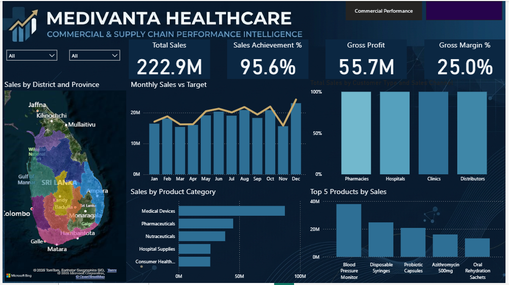

# 📊 MEDIVANTA HEALTHCARE — Commercial & Supply Chain Performance Intelligence

> **An interactive Power BI solution for monitoring commercial performance, profitability, supply chain efficiency, inventory risk, and regional business performance across Sri Lanka.**

---

## 🎯 Project Overview

**MEDIVANTA HEALTHCARE — Commercial & Supply Chain Performance Intelligence** is a management-focused Power BI dashboard developed to provide a consolidated view of **commercial and supply chain performance**.
The solution transforms structured business data into actionable insights, helping management identify **performance gaps, revenue drivers, fulfillment issues, inventory risks, regional bottlenecks, and operational priorities**.

---

## 💼 Business Objective

The dashboard is designed to support data-driven decision-making by providing visibility into:

- Sales performance against targets
- Revenue and profitability across products, customers, channels, and regions
- Supply chain and order fulfillment performance
- On-time delivery and service-level performance
- Inventory availability and stockout risks
- Regional backlog and operational bottlenecks
- Distributor and channel partner performance

---

## 📑 Dashboard Overview

### 01 — 📊 Commercial Performance

Analyzes commercial performance across products, customer types, sales channels, districts, and provinces.

**Key KPIs**

- Total Sales
- Sales Achievement %
- Gross Profit
- Gross Margin %

**Key Analysis**

- Sales by District and Province
- Monthly Sales vs Target
- Sales by Customer Type & Sales Channel
- Sales by Product Category
- Top 5 Products by Sales

**Management Focus**

> Identify revenue drivers, sales performance gaps, high-performing products and channels, and regional commercial opportunities.

---

### 02 — 🚚 Supply Chain & Inventory Performance

Monitors fulfillment efficiency, delivery reliability, inventory availability, backlog, and distributor performance.

**Key KPIs**

- Fill Rate %
- On-Time Delivery %
- Total Backlog
- Reorder Risk %

**Key Analysis**

- Supply Chain Performance by District
- Monthly On-Time Delivery Trend
- Stock on Hand vs Reorder Level
- Backlog by Province
- Distributor Performance

**Management Focus**

> Identify fulfillment gaps, supply chain bottlenecks, inventory risks, regional priorities, and distributor performance issues.

---

## 📈 Key Business Insights

The dashboard enables management to evaluate:

- Commercial performance against targets
- Revenue contribution by region and sales channel
- Product and category performance
- Profitability and margin performance
- Order fulfillment and delivery efficiency
- Inventory levels against reorder thresholds
- Regional backlog concentration
- Distributor and channel partner performance

---

## 🗺️ Geographic Business Intelligence

A key component of the solution is **district and province-level analysis across Sri Lanka**.

Geographic analysis enables users to identify differences in:

- Sales performance
- Revenue contribution
- Supply chain efficiency
- Order backlog
- Fulfillment performance
- Inventory risk

This supports a more targeted approach to **regional commercial planning, inventory prioritization, and supply chain management**.

---

## 📊 Data Model

The dashboard integrates five major analytical areas:

| Area | Key Data |
|---|---|
| **Commercial** | Sales, targets, profit, margin, pricing, cost |
| **Customer & Channel** | Customer type, sales channel, distributor |
| **Supply Chain** | Fill rate, OTD, backlog, delivery status, lead time |
| **Inventory** | Stock on hand, reorder level, reorder risk, stockout risk |
| **Geography & Time** | District, province, year, month |

### Core Data Fields

**Commercial**

`Total Sales` · `Sales Target` · `Sales Achievement %` · `Gross Profit` · `Gross Margin %` · `Unit Price` · `Unit Cost` · `Total Cost` · `Qty Ordered` · `Qty Delivered`

**Supply Chain & Inventory**

`Fill Rate %` · `On-Time Delivery %` · `Total Backlog` · `Backlog Quantity` · `Reorder Risk %` · `Reorder Risk Flag` · `Stockout Flag` · `Stock On Hand` · `Reorder Level` · `Lead Time`

**Dimensions**

`Product Category` · `Product Name` · `Customer Type` · `Sales Channel` · `Distributor / Channel Partner` · `District` · `Province` · `Year` · `Month`

---

## 🛠️ Tools & Technologies

- **Microsoft Power BI**
- **DAX**
- **Power Query**
- **Microsoft Excel**
- Data Modeling
- KPI Development
- Business Intelligence
- Commercial Analytics
- Supply Chain Analytics
- Inventory Risk Analysis
- Geographic Performance Analysis

---

## 🎨 Dashboard Design

The dashboard follows an **executive-style design approach** focused on clarity, usability, and fast decision-making.

### Design Features

- Interactive KPI cards
- Dynamic slicers and filters
- Geographic performance maps
- Target vs Actual analysis
- Monthly trend analysis
- Product and category rankings
- Inventory risk indicators
- Regional performance comparison
- Distributor performance analysis

---

## 📸 Dashboard Preview

### 📊 Commercial Performance

### 🚚 Supply Chain & Inventory Performance

---

## 💡 Business Value

The solution connects **commercial performance with supply chain execution**, allowing management to view revenue performance and operational risks within a single analytical environment.

It supports:

- Faster management performance reviews
- Early identification of commercial and operational risks
- Better inventory prioritization
- Improved regional visibility
- More informed commercial decisions
- More effective supply chain monitoring
- Data-driven performance management

---

## 🎯 Intended Audience

This dashboard is designed for:

- Senior Leadership
- Commercial Managers
- Sales Teams
- Supply Chain Managers
- Inventory & Planning Teams
- Business Analysts
- Management Reporting Teams

---

## 📂 Repository Contents

| File | Description |
|---|---|
| `MEDIVANTA_Commercial_SupplyChain_Performance.pbix` | Interactive Power BI dashboard |
| `commercial-performance.png` | Commercial Performance preview |
| `supply-chain-inventory.png` | Supply Chain & Inventory Performance preview |
| `README.md` | Project documentation |

---

## 👩‍💻 Project Focus

This project demonstrates the practical application of **Business Intelligence, Power BI, DAX, data modeling, and analytical thinking** to transform business data into a management-ready decision-support solution.

The project focuses on the complete analytical process:

**Transform Data → Measure Performance → Identify Risks → Generate Insights → Support Decisions**

---

## 📌 Disclaimer

> **MEDIVANTA HEALTHCARE is a fictional business case created for portfolio and analytical demonstration purposes. The data used in this dashboard is simulated and does not represent actual company information.**
